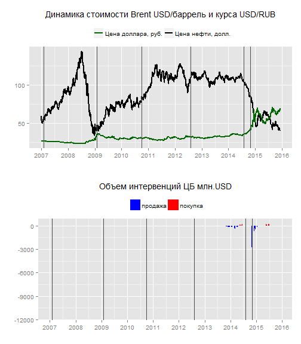
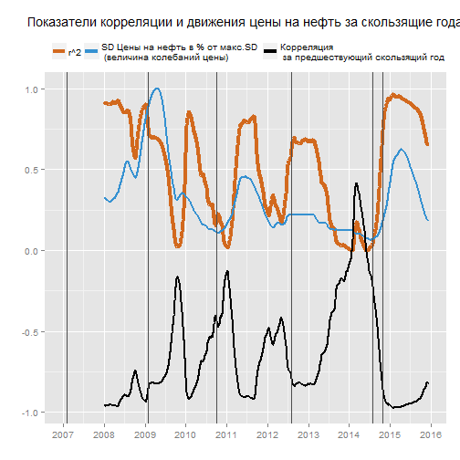
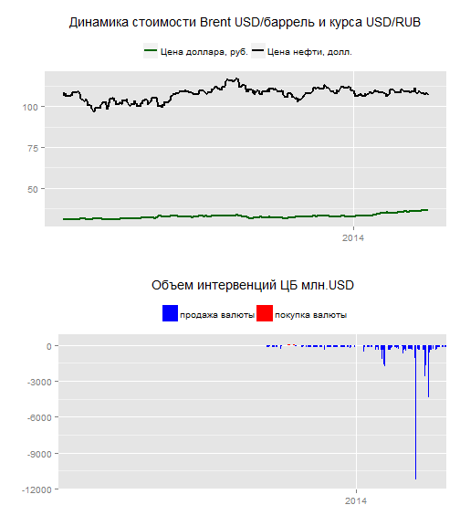
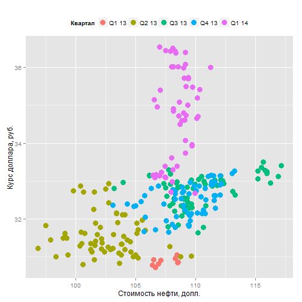
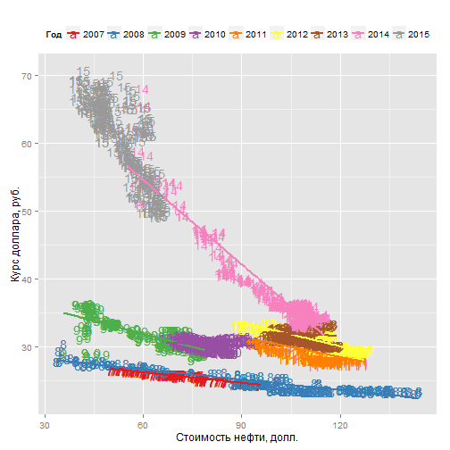
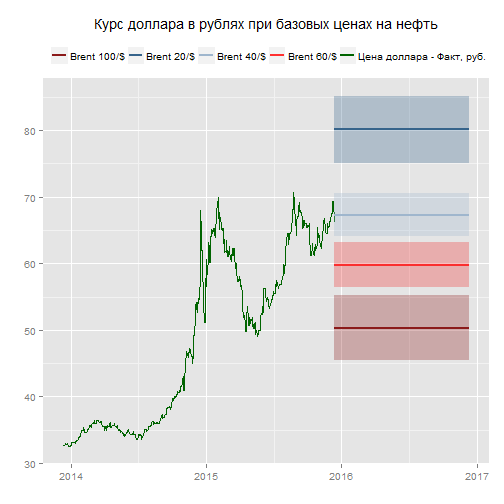
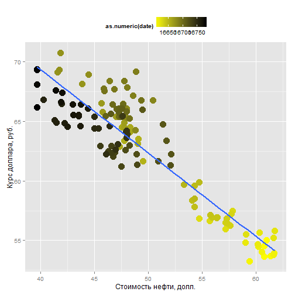
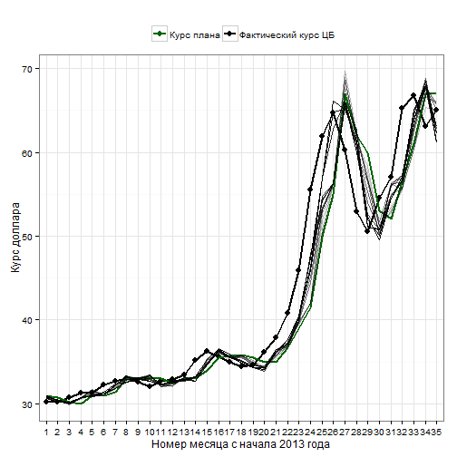
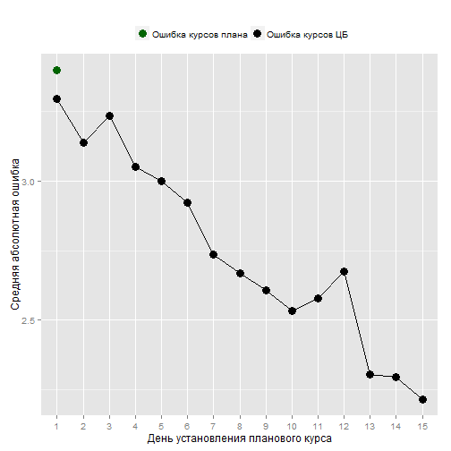

 

 

 

 
## Исследование зависимости
 
Для начала необходимо определить характер влияния стоимости нефти на курс доллара.
 
На графике ниже, в верхней его части, представлена динамика курса доллара в рублях[^usd] и стоимости барреля нефти[^oil] марки Brent в долларах за период с 2007 года по настоящее время. Соответственно, для графика стоимости нефти ость X отражает стоимость в долларах, а для графика курса доллара - его стоимость (курс) в рублях. Темными вертикальными линиями отмечены дата существенных изменений в [политике ЦБ по регулированию курса](http://www.cbr.ru/dkp/?PrtId=e-r_policy) рубля относительно других валют.
 
Нижний график привден справочно, показывает дневные объемы интервенций ЦБ РФ на валютном рынке[^interventions]. "+" - покупка валюты, "-" - продажа валюты. Данные доступны только с конца 2013 года.
 
По верхнему графику можно отметить, что между курсом доллара и ценой на нефть существует некая обратно пропорциональная зависимость. Например, в период с 2007 года по середину 2008 цена на нефть растет, а курс доллара падает. Далее, ближе к началу 2009 года нефть падает, а доллар растет. Аналогичную картину можно наблюдать и в других периодах.
 
Что еще можно заметить, так это то что в разные периоды изменения имеют разную динамику: в начале графика движения курса доллара, связанные с движением стоимости нефти гораздо менее резкие чем в конце. То есть сила колебаний курса доллара при более-менее одинаковых движениях в цене нефти меняется со временем, в общем даже можно сказать, что она растет.
 
 
 
Это сильное свидетельство в пользу предположения, что характер зависимости кусра доллара от стоимости нефти меняется со временем. А значит модель, хорошо объясняющая зависимость, например, в 2008 году, скорее всего, будет плохо работать в 2015. Отсюда же следует что модель построенная на полном наборе данных тоже должна быть менее точной модели построенной на данных, ограниченных более поздним периодом. В модели, построенной на полных данных, старые данные, со старой, отличающейся от сегодняшней зависимостью, будут систематически *смещать* оценку зависимости курса.
 
Таким образом разумно для описания сегодняшней зависимости брать только последние данные, но какой именно период брать? Очевидно, что данные за один день не дадут нам представления о характере влияния нефти на доллар[^1].
 
Неделя  - семь точек - кажется, тоже недостаточный период для того что бы *поймать* характер зависимости. В общем случае, т.к. мы не можем судить о том, с какой периодичностью меняется характер зависимости, и, более того, можем предположить, что никакой строгой периодичности в таких изменениях нет, выбор "окна" - периода по которому строить модель, достаточно произволен.
 
Чем меньше точек мы возьмем к сегодняшнему моменту - тем выше шанс, что на нашу модель не будет влиять уже неактуальная зависимость и тем быстрее мы будем "ловить" изменения в этой зависимости. С другой стороны - чем больше точек, тем больше данных и тем точнее и увереннее мы можем судить о характере зависимости.
 
С моей точки зрения это проявление широко известного конфликта в статистическом моделировании: [Bias–variance tradeoff](https://en.wikipedia.org/wiki/Bias%E2%80%93variance_tradeoff). Его можно охарактеризовать как компромисс между ошибкой из-за систематического смещения в оценке (в данном случае из-за "устаревших" данных) и ошибкой в следствии статистической "неуверенности" из-за слишком малого количества данных.
 
Здесь я предлагаю для моделирования брать период длинною в год, а точнее в 365 дней. Аргументом в пользу такого периода является то, что в случае если и существует какая-то сезонность в изменениях курсов, она будет учитываться. Тем не менее, можно пробовать брать разные периоды, например 30 или 90 дней.
 
Попробуем изучить изменение зависимости нефть-доллар во времени. В каждой точке, т.е. каждый день, мы можем брать его и 364 предшествующих ему дня, и строить по такому скользящему году модель[^2]. После чего сдвигать это "окно" на один день вправо и строить модель снова. Таким образом, для каждой точки, за исключением первых 364 мы можем построить модель которая будет включать данные за скользящий год.
 
На графике ниже коричневая линия отражает показатель r^2^[^3] для каждой модели. Его можно описать как процент, на который изменения курса доллара  объясняются изменениями цены на нефть. 1 - означает 100% зависимость, 0 - отсутствие какой-либо зависимости.
 
 
 
Мы видим, что величина зависимости сильно колеблется практически от нуля до единицы. То есть периоды когда зависимость достигает максимума, а есть - где она практически не выделяется. Конечно, учитывая вышесказанное предположение о том что характер зависимости меняется со временем, а особенно если предположить что бывают ситуации радикальных изменений, например, когда противоположное движение показателей сменяется однонаправленным, наш скользящий год может поймать "хвосты" двух противоположных (прямо пропорциональной и обратно пропорциональной) зависимостей, из-за которых модель покажет околонулевое значение r^2^. Тем не менее, кажется, что зависимость курса доллара в рублях и цены на нефть в долларах должна всегда иметь обратный характер: цена на нефть расчет - курс доллара падает, и наоборот. Судя по верхнему графику, похоже что обычно так оно и есть. Тем не менее, ниже мы увидим что был как минимум один момент когда несмотря на рост нефти так же рос курс доллара.
 
Когда коричневая кривая растет это значит что курс доллара все лучше и лучше согласуется с ценой на нефть, и предшествующий тренд все более подтверждается новыми данными. Когда кривая падает это говорит либо о том, что на курс доллара все более начинают влиять факторы не связанные с ценой на нефть либо о том что происходит изменение характера зависимости. Впрочем, если характер не меняется кардинально (когда меняется направление: знак зависимости), этот показатель не должен опускаться до нуля. И около нулевые значения все-таки означают что конкретно в эти 365 дней выраженной зависимости не наблюдалось.
 
Синяя линия - стандартное отклонение цены на нефть за скользящий год. Она характеризует насколько сильно менялась цена на нефть за предшествующие 365 дней. Можно заметить, что пики двух кривых более-менее совпадаю, отсюда можно сделать что влияние стоимости нефти на курс доллара становится более выраженным в случаях более сильных изменений стоимости нефти. Когда стоимость нефти изменяется слабо, зависимость курса доллара от нее падает. Судя по всему, влияние других факторов становится более значимым.
 
Это можно объяснить существовавшим валютным коридором: ЦБ РФ нивелировал относительно слабые колебания курса с помощью валютных интервенций, а в случае сильных изменений плавно двигал валютный коридор.
 
"С 10 ноября 2014 года Банк России упразднил действовавший ранее механизм курсовой политики, отменив интервал допустимых значений стоимости бивалютной корзины и регулярные интервенции на границах указанного интервала и за его пределами. При этом, новый подход Банка России к проведению операций на внутреннем рынке не предполагает полного отказа от валютных интервенций, их проведение возможно в случае возникновения угроз для финансовой стабильности." - [ЦБ РФ](http://www.cbr.ru/dkp/?PrtId=e-r_policy)
 
На самом деле фактическая отмена валютного коридора произошла чуть ранее: "С 18 августа 2014 года Банк России установил объем интервенций, направленных на сглаживание колебаний курса рубля, во внутренних диапазонах плавающего операционного интервала равным 0 долларов США."
 
Две эти даты отмечены последними вертикальными линиями на графиках.
 
По идее это должно привести к тому что доллар будет реагировать на нефть острее. В принципе, мы можем это наблюдать: в конце 2008 года цена на нефть упала еще сильнее, чем сегодня, но влияние на курс было не таким значительным. Так же, представляется, доллар в отсутствие регулярных интервенций теперь должен лучше "отрабатывать" незначительные колебания цены на нефть[^smallmoves], которые раньше сглаживались валютным коридором.
 
Черная линия - величина корреляции курса доллара и цены на нефть. Мы видим, что ее значения, в основном, лежат в отрицательной области, а значит зависимость действительно обратная. Интересный пик графика корреляции находится в районе 1кв. 2014 года, точнее, он приходится на дату: 17 марта 2014г. Корреляция заходит в область положительных значений, а значит, зависимость на короткий отрезок времени становится прямой: нефть растет, и курс растет!
 
Похоже, низкая корреляция вокруг этого пика объясняется тем, что наш скользящий год захватывает части разных зависимостей: прямой и обратной, они нивелируют друг друга в течении этого период и корреляция становится близкой к нулю.
 
Рассмотрим этот период (скользящий год с 18 марта 2013 по 17 марта 2014) подробнее на графике ниже:
 
 
 
Можно наблюдать что в этот период растет как цена нефти, так и курса доллара. Особенно интересно, что ЦБ ближе к концу начинает осуществляет масштабные продажи валюты, но, несмотря на это и на рост нефти курс доллара продолжает расти! На графике за полный период выше видно, что после интервенций курс ненадолго снижается, к сожалению лишь за тем что бы резко вырасти вслед за масштабным падением цены на нефть.
 
Посмотрим на график зависимости курса доллара от стоимости нефти в этот период:
 
 
 
Цвет точек отражает квартал интересующего нас периода. Мы можем наблюдать в первый и второй кварталы 2013 года обычную, хоть и не слишком четко выраженную, обратную зависимость: дороже нефть - ниже курс. Но в следующие два квартала зависимость неожиданно меняется на противоположную[^noimpact]. Первый квартал 2014 года вообще не говорит о наличии какой-либо зависимости: курс просто растет при не меняющейся цене на нефть.
 
можно увидеть в первый квартал 2013 и первый квартал 2014 года цена на нефть приблизительно находится в одном диапазоне, а курс просто вырос на 5 рублей. При том, что именно на первый квартал 2014 приходятся продажи валюты ЦБ. Т.е. курс вырос, несмотря на два сильных давящих фактора.
 
Это свидетельство того, что могут быть ситуации, когда не только нефть (и давление ЦБ) влияет на курс. Причины такого аномального роста подлежат дополнительному исследованию. Мы должны с осторожностью говорить об обратной зависимости курса доллара и нефти, она, безусловно, в общем, существует, но локально может и не выполнятся: мы это видели на протяжении трех кварталов.
 
Как же вообще менялась зависимость курса доллара и нефти на протяжении этих лет? График ниже, в целом, повторяет предыдущий, только цветом выделяются года. Точки отмечены цифрами, отражающими номер года.
 
 
Скользя взглядом по графику снизу вверх, от 7,8 до 15 года мы видим что курс доллара, в общем, растет из года в год, несмотря на нефть. В каждый календарный год вписан простая линейная зависимость[^linearTrend]. Помимо общего роста курса прямая - линейная зависимость - все круче, угол ее наклона все больше. То есть изменение цены на нефть на 1 доллар с каждым годом все сильнее отражается на курсе доллара.
 
## Прогнозирование
 
Я бы хотел обосновать точку зрения, в соответствии с которой прогнозирование курса доллара, основываясь на представлениях о цене на нефть в будущем представляется затруднительным.
 
Ошибка в прогнозе курса в таком случае будет состоять из следующих компонентов:
 - во-первых, ошибка прогноза стоимости нефти;
 - во-вторых, ошибка самой модели[^modelError], основанной на стоимости нефти;
- и в-третьих, неустранимой ошибки при любом моделировании: "белого шума" в реальных значениях курса.
 
Раскроем первые две составляющие подробнее.
 
Цена на нефть имеет рыночную природу. И, похоже, что на нее влияет гораздо больше факторов, чем на тот же курс, который, тоже устанавливается рынком, но который во многом, как мы показали, зависит от цены на нефть. Несмотря на эту зависимость, из-за природы цены на нефть она навряд ли сможет нам помочь в вопросе прогнозирования курса.
 
Но и сама эта зависимость непостоянна, мы видим что она меняется со временем, и, порой, меняется очень сильно. Перед нами встает вопрос, насколько глубоко в историю смотреть для определения *сегодняшней* зависимости. Конечно, мы можем брать в расчет всего несколько предстоящих дней, но тогда если, допустим, по какой либо случайности в последний день курс существенно отклонится *действительно* существующего тренда, эта точка "потянет" ошибочно потянет за собой весь тренд.
 
Помимо вышеуказанных проблем, даже если мы выберем наилучшее количество предшествующих точек, мы не можем быть уверены, что завтра характер зависимости курса от нефти не изменится.
 
К описанию сложности прогнозирования курса можно подойти с другой стороны: если бы кто-то нашел хороший способ прогнозировать курс доллара, он непременно постарался бы этим воспользоваться. Учитывая рыночную природу курса доллара действия этого агента на рынке свели бы эту зависимость на нет[^money]. Покупая и продавая валюту на пиках падения и роста, имея достаточно ресурсов, этот агент создавал бы спрос и предложение, которые двигали бы цену в противоположную сторону, выравнивая тренд. Таким образом, невероятным представляется даже стабильно успешно предсказывать хотя бы направление движения курса.
 
Тем не менее, судя по последнему графику, можно сказать что рубль, независимо от цен на нефть, имел тенденцию дешеветь. Если грубо оценить, то при похожих ценах на нефть в 2007 и 2015 годах рубль подешевел в 2 раза (за 9 лет это в среднем по 8% в год). Если рассматривать рубль как валюту, за которую можно приобрести продукцию РФ, а доллар - продукцию США, то эти 8% в год могут отражать разницу в инфляции в РФ и США[^inflation].
 
Попробуем представить хоть какой-то прогноз при базовых уровнях цены на нефть марки Brent в 20, 40 и 60 долларов США. Модель будем строить на последних 90 днях. Брать год кажется не логичным учитывая, что недавно произошли существенные изменения в регулировании курса Центральным Банком.
 
 
 
Закрашенная область показывает интервал 95% уверенности, в котором должен находиться курс доллара при указанной цене на нефть[^interval].
 
Интервалы достаточно широкие, впрочем, видно, что даже если нефть вернется на прежние уровни к 100 долларам за баррель, курс уже не должен опустится сильно ниже 50 рублей. С другой стороны, при апокалиптическом сценарии падения нефти до 20 долларов, кажется, курс не будет сильно выше 80 рублей.
 
 
 
В принципе, можно заложить в прогноз удешевление рубля относительно доллара, аналогичное наблюдаемому в предыдущие годы - около 8% в среднем. Но для этого, неплохо бы лучше изучить его характер и причины. Ведь были годы, когда оно практически не проявлялось и годы резкого падения стоимости рубля.
 
## Прогнозирование курса на основе его последнего значения
 
Рассмотрим возможности "наивного" способа прогнозирования курса доллара на следующий месяц. Это способ при котором, например, плановый курс на следующий месяц устанавливается равным последнему известному фактическому курсу.
 
Фактический курс месяца M определим как средний курс ЦБ за все дни этого месяца.
 
Плановые курсы месяца М будем устанавливать равными фактическим курсам на 1-ое, 2-ое, ..., 15-ое числа месяца M-1 (месяца, предшествующего М).
 
Установим таким образом курсы для 35 месяцев в периоды с января 2013 по ноябрь 2015. В качестве ошибки планирования будем использовать среднюю ошибку отклонений плановых курсов от фактических за эти 35 месяцев.
 
В качестве бенчмарка будем использовать плановые курсы, установленные в нашей компании за эти месяцы и их среднее отклонение от фактических курсов. Для корректного сравнения, по возможности, были взяты курсы без корректировок. Эти курсы обычно устанавливаюся в первый день месяца M-1 (предшесвующего планируемому), либо в последний день месяца М-2 (за два месяца до планируемого).
 
На графике ниже изображены значения курсов доллара за 35 месяцев с начала 2013 года. Черная линия я с точками - фактические среднемесячные курсы, зеленая линия - установленые плановые курсы без корректировок за соответствующие месяца, градиентом от светло-серого до черного изображены плановые курсы, как зафиксированные курсы ЦБ на даты с 1 по 15 предыдущего месяца; самая светлая линия - на 1, самая темная - на 15.
 
 
 
Рассчитаем среднюю абсолютную ошибку как среднее значения отклонения (без знака) от фактического курса. На графике ниже изображено как уменьшается средняя ошибка с установлением курса все все ближе и ближе к планируемому месяцу. Зеленая точка - средняя ошибка плановых курсов, установленных внутри компании.
 
 
 
Можно увидеть, что "наивный" способ планирования в среднем дает не такие плохие результаты относительно экспертного способа. Как уже говорилось, так простой способ планирования можно использовать как бенчмарк других более сложных моделей. Использовать более сложные модели имеет смысл если они дают меньшую среднюю ошибку.
 
Мне кажется - это хорошая иллюстрация того, что в общем, довольно сложно предположить что-то о том, каким будет курс доллара, кроме того, что он будет в какой-то степени похож на сегодняшний.
 
Вообще говоря, судя по всему, именно этой методикой планирования пользуется ЦБ РФ когда устанавливает курс официаьный курс "на завтра" по сути фиксируя сегодняшний курс в 11:30.
 
*****

|Месяц  |  факт|  план| ЦБ.01| ЦБ.02| ЦБ.03| ЦБ.04| ЦБ.05| ЦБ.06| ЦБ.07| ЦБ.08| ЦБ.09| ЦБ.10| ЦБ.11| ЦБ.12| ЦБ.13| ЦБ.14| ЦБ.15|
|:------|-----:|-----:|-----:|-----:|-----:|-----:|-----:|-----:|-----:|-----:|-----:|-----:|-----:|-----:|-----:|-----:|-----:|
|янв.13 | 30.26| 31.00| 30.81| 30.81| 30.81| 30.84| 30.99| 30.82| 30.91| 30.97| 30.97| 30.97| 30.87| 30.75| 30.73| 30.60| 30.69|
|фев.13 | 30.16| 30.70| 30.37| 30.37| 30.37| 30.37| 30.37| 30.37| 30.37| 30.37| 30.37| 30.42| 30.36| 30.25| 30.25| 30.25| 30.26|
|мар.13 | 30.80| 30.20| 30.02| 30.00| 30.00| 30.00| 29.93| 30.12| 29.96| 30.05| 30.16| 30.16| 30.16| 30.16| 30.17| 30.07| 30.08|
|апр.13 | 31.33| 30.00| 30.51| 30.64| 30.64| 30.64| 30.79| 30.70| 30.62| 30.76| 30.76| 30.76| 30.76| 30.76| 30.75| 30.72| 30.78|
|май.13 | 31.24| 31.00| 31.08| 31.11| 31.12| 31.39| 31.72| 31.62| 31.62| 31.62| 31.61| 31.21| 31.00| 30.88| 30.93| 30.93| 30.93|
|июн.13 | 32.28| 31.00| 31.04| 31.04| 31.04| 31.04| 31.04| 31.04| 31.08| 31.08| 31.08| 31.08| 31.08| 31.08| 31.08| 31.38| 31.28|
|июл.13 | 32.74| 31.40| 31.80| 31.80| 31.80| 32.05| 31.83| 31.98| 32.14| 32.24| 32.24| 32.24| 32.32| 32.40| 32.40| 32.35| 31.80|
|авг.13 | 33.02| 33.00| 32.71| 32.85| 32.95| 33.22| 33.16| 33.22| 33.22| 33.22| 33.32| 33.08| 32.91| 32.59| 32.64| 32.64| 32.64|
|сен.13 | 32.63| 33.00| 33.03| 32.97| 33.10| 33.10| 33.10| 32.88| 32.94| 32.98| 32.94| 32.86| 32.86| 32.86| 32.89| 33.04| 33.16|
|окт.13 | 32.06| 33.00| 33.25| 33.25| 33.25| 33.37| 33.47| 33.39| 33.43| 33.43| 33.43| 33.32| 33.06| 32.96| 32.67| 32.74| 32.74|
|ноя.13 | 32.65| 33.00| 32.48| 32.30| 32.30| 32.12| 32.10| 32.10| 32.10| 32.29| 32.30| 32.36| 32.36| 32.21| 32.21| 32.21| 32.27|
|дек.13 | 32.89| 32.50| 32.08| 32.18| 32.18| 32.18| 32.18| 32.35| 32.45| 32.38| 32.55| 32.55| 32.55| 32.66| 32.81| 32.82| 32.69|
|янв.14 | 33.46| 33.00| 33.19| 33.19| 33.15| 33.25| 33.26| 33.11| 32.95| 32.95| 32.95| 32.78| 32.78| 32.73| 32.75| 32.87| 32.87|
|фев.14 | 35.23| 33.00| 32.66| 32.66| 32.66| 32.66| 32.66| 32.66| 32.66| 32.66| 32.66| 33.15| 33.21| 33.21| 33.21| 33.12| 33.24|
|мар.14 | 36.21| 34.00| 35.18| 35.18| 35.18| 35.23| 35.45| 34.96| 34.73| 34.60| 34.60| 34.60| 34.76| 34.80| 34.76| 34.86| 35.26|
|апр.14 | 35.66| 35.50| 36.18| 36.18| 36.18| 36.38| 36.32| 36.08| 36.13| 36.26| 36.26| 36.26| 36.26| 36.40| 36.49| 36.46| 36.64|
|май.14 | 34.93| 35.75| 35.61| 35.02| 35.25| 35.52| 35.50| 35.50| 35.50| 35.47| 35.55| 35.75| 35.56| 35.62| 35.62| 35.62| 35.99|
|июн.14 | 34.41| 35.80| 35.72| 35.72| 35.72| 35.72| 35.72| 35.84| 35.66| 35.50| 35.03| 35.03| 35.03| 35.03| 35.21| 34.88| 34.71|
|июл.14 | 34.64| 35.50| 34.74| 34.74| 34.89| 35.01| 35.14| 34.90| 34.66| 34.66| 34.66| 34.33| 34.37| 34.32| 34.32| 34.32| 34.32|
|авг.14 | 36.11| 35.00| 33.84| 34.23| 34.25| 34.19| 34.32| 34.32| 34.32| 34.57| 34.43| 34.08| 33.84| 34.06| 34.06| 34.06| 34.31|
|сен.14 | 37.88| 35.00| 35.44| 35.73| 35.73| 35.73| 35.66| 35.80| 36.11| 36.25| 36.45| 36.45| 36.45| 36.05| 36.09| 36.22| 36.04|
|окт.14 | 40.77| 36.75| 36.93| 37.29| 37.35| 37.32| 36.80| 36.92| 36.92| 36.92| 37.09| 37.03| 37.17| 37.38| 37.65| 37.65| 37.65|
|ноя.14 | 45.91| 39.00| 39.38| 39.66| 39.55| 39.70| 39.70| 39.70| 39.98| 39.74| 39.98| 39.98| 40.21| 40.21| 40.21| 40.33| 40.53|
|дек.14 | 55.54| 41.50| 41.96| 41.96| 41.96| 41.96| 41.96| 44.40| 45.19| 47.88| 47.88| 47.88| 45.89| 45.95| 46.34| 46.12| 47.39|
|янв.15 | 61.88| 50.00| 49.32| 51.81| 50.77| 54.38| 52.69| 53.11| 53.11| 53.11| 53.31| 54.21| 54.28| 54.79| 56.89| 56.89| 56.89|
|фев.15 | 64.68| 55.00| 56.24| 56.24| 56.24| 56.24| 56.24| 56.24| 56.24| 56.24| 56.24| 56.24| 56.24| 56.24| 62.74| 64.84| 66.10|
|мар.15 | 60.26| 67.00| 68.93| 68.93| 69.66| 67.77| 65.45| 68.61| 66.04| 66.04| 66.04| 65.78| 65.45| 66.06| 66.10| 65.09| 65.09|
|апр.15 | 52.93| 62.00| 61.27| 61.27| 62.22| 62.36| 61.87| 61.85| 59.99| 59.99| 59.99| 59.99| 60.66| 62.68| 60.96| 61.32| 61.32|
|май.15 | 50.59| 60.00| 57.65| 58.35| 56.99| 56.75| 56.75| 56.75| 56.52| 55.33| 54.03| 52.54| 51.07| 51.07| 51.07| 52.42| 51.97|
|июн.15 | 54.51| 53.00| 51.14| 51.14| 51.14| 51.14| 51.14| 51.76| 49.98| 50.36| 50.75| 50.75| 50.75| 50.75| 50.91| 49.54| 50.08|
|июл.15 | 57.08| 52.00| 52.97| 52.82| 53.44| 53.06| 54.99| 56.25| 56.25| 56.25| 56.04| 55.91| 54.82| 54.53| 54.53| 54.53| 54.53|
|авг.15 | 65.20| 56.50| 55.84| 55.48| 55.66| 55.60| 55.60| 55.60| 56.41| 57.22| 57.22| 56.98| 56.67| 56.67| 56.67| 56.61| 56.98|
|сен.15 | 66.77| 61.00| 60.35| 60.35| 60.35| 62.47| 62.92| 62.72| 63.86| 63.84| 63.84| 63.84| 64.50| 63.21| 65.02| 64.00| 64.94|
|окт.15 | 63.09| 67.00| 66.72| 65.35| 66.68| 67.01| 67.69| 67.69| 67.69| 68.49| 68.79| 67.62| 68.50| 68.01| 68.01| 68.01| 67.96|
|ноя.15 | 65.03| 67.00| 65.74| 65.03| 65.94| 65.94| 65.94| 65.62| 65.10| 62.71| 62.29| 61.30| 61.30| 61.30| 61.15| 62.22| 63.12|

|Месяц  |  факт|   план|  ЦБ.01|  ЦБ.02|  ЦБ.03|  ЦБ.04|  ЦБ.05|  ЦБ.06|  ЦБ.07| ЦБ.08| ЦБ.09| ЦБ.10| ЦБ.11| ЦБ.12| ЦБ.13| ЦБ.14| ЦБ.15|
|:------|-----:|------:|------:|------:|------:|------:|------:|------:|------:|-----:|-----:|-----:|-----:|-----:|-----:|-----:|-----:|
|янв.13 | 30.26|   0.74|   0.55|   0.55|   0.55|   0.58|   0.74|   0.57|   0.65|  0.71|  0.71|  0.71|  0.61|  0.49|  0.47|  0.35|  0.43|
|фев.13 | 30.16|   0.54|   0.21|   0.21|   0.21|   0.21|   0.21|   0.21|   0.21|  0.21|  0.21|  0.26|  0.20|  0.09|  0.09|  0.09|  0.10|
|мар.13 | 30.80|  -0.60|  -0.78|  -0.80|  -0.80|  -0.80|  -0.87|  -0.68|  -0.84| -0.75| -0.64| -0.64| -0.64| -0.64| -0.63| -0.73| -0.72|
|апр.13 | 31.33|  -1.33|  -0.82|  -0.69|  -0.69|  -0.69|  -0.54|  -0.63|  -0.71| -0.57| -0.57| -0.57| -0.57| -0.57| -0.58| -0.61| -0.55|
|май.13 | 31.24|  -0.24|  -0.16|  -0.13|  -0.12|   0.15|   0.48|   0.38|   0.38|  0.38|  0.37| -0.03| -0.24| -0.36| -0.31| -0.31| -0.31|
|июн.13 | 32.28|  -1.28|  -1.24|  -1.24|  -1.24|  -1.24|  -1.24|  -1.24|  -1.20| -1.20| -1.20| -1.20| -1.20| -1.20| -1.20| -0.90| -1.00|
|июл.13 | 32.74|  -1.34|  -0.94|  -0.94|  -0.94|  -0.69|  -0.90|  -0.76|  -0.60| -0.50| -0.50| -0.50| -0.41| -0.34| -0.34| -0.39| -0.93|
|авг.13 | 33.02|  -0.02|  -0.31|  -0.16|  -0.07|   0.20|   0.14|   0.21|   0.21|  0.21|  0.31|  0.07| -0.10| -0.43| -0.37| -0.37| -0.37|
|сен.13 | 32.63|   0.37|   0.40|   0.34|   0.46|   0.46|   0.46|   0.25|   0.30|  0.35|  0.31|  0.23|  0.23|  0.23|  0.26|  0.41|  0.52|
|окт.13 | 32.06|   0.94|   1.18|   1.18|   1.19|   1.31|   1.40|   1.33|   1.37|  1.37|  1.37|  1.26|  1.00|  0.90|  0.61|  0.68|  0.68|
|ноя.13 | 32.65|   0.35|  -0.16|  -0.35|  -0.35|  -0.52|  -0.55|  -0.55|  -0.55| -0.35| -0.35| -0.28| -0.29| -0.43| -0.43| -0.43| -0.38|
|дек.13 | 32.89|  -0.39|  -0.82|  -0.71|  -0.71|  -0.71|  -0.71|  -0.54|  -0.44| -0.51| -0.35| -0.35| -0.35| -0.23| -0.09| -0.08| -0.21|
|янв.14 | 33.46|  -0.46|  -0.27|  -0.27|  -0.32|  -0.22|  -0.20|  -0.35|  -0.51| -0.51| -0.51| -0.69| -0.68| -0.73| -0.71| -0.60| -0.60|
|фев.14 | 35.23|  -2.23|  -2.57|  -2.57|  -2.57|  -2.57|  -2.57|  -2.57|  -2.57| -2.57| -2.57| -2.07| -2.02| -2.02| -2.02| -2.11| -1.99|
|мар.14 | 36.21|  -2.21|  -1.03|  -1.03|  -1.03|  -0.98|  -0.76|  -1.25|  -1.48| -1.61| -1.61| -1.61| -1.45| -1.42| -1.45| -1.35| -0.96|
|апр.14 | 35.66|  -0.16|   0.52|   0.52|   0.52|   0.72|   0.66|   0.42|   0.46|  0.60|  0.60|  0.60|  0.60|  0.74|  0.82|  0.79|  0.98|
|май.14 | 34.93|   0.82|   0.67|   0.09|   0.32|   0.58|   0.57|   0.57|   0.57|  0.54|  0.62|  0.82|  0.63|  0.69|  0.69|  0.69|  1.06|
|июн.14 | 34.41|   1.39|   1.31|   1.31|   1.31|   1.31|   1.31|   1.43|   1.25|  1.09|  0.63|  0.63|  0.63|  0.63|  0.80|  0.47|  0.30|
|июл.14 | 34.64|   0.86|   0.10|   0.10|   0.25|   0.37|   0.50|   0.27|   0.02|  0.02|  0.02| -0.31| -0.27| -0.32| -0.32| -0.32| -0.32|
|авг.14 | 36.11|  -1.11|  -2.27|  -1.88|  -1.86|  -1.92|  -1.79|  -1.79|  -1.79| -1.54| -1.69| -2.04| -2.28| -2.05| -2.05| -2.05| -1.80|
|сен.14 | 37.88|  -2.88|  -2.43|  -2.15|  -2.15|  -2.15|  -2.22|  -2.08|  -1.77| -1.63| -1.43| -1.43| -1.43| -1.83| -1.79| -1.65| -1.84|
|окт.14 | 40.77|  -4.02|  -3.84|  -3.48|  -3.42|  -3.45|  -3.97|  -3.85|  -3.85| -3.85| -3.68| -3.74| -3.60| -3.40| -3.12| -3.12| -3.12|
|ноя.14 | 45.91|  -6.91|  -6.53|  -6.25|  -6.37|  -6.22|  -6.22|  -6.22|  -5.93| -6.17| -5.93| -5.93| -5.70| -5.70| -5.70| -5.59| -5.38|
|дек.14 | 55.54| -14.04| -13.58| -13.58| -13.58| -13.58| -13.58| -11.14| -10.35| -7.66| -7.66| -7.66| -9.65| -9.59| -9.20| -9.42| -8.15|
|янв.15 | 61.88| -11.88| -12.56| -10.07| -11.11|  -7.50|  -9.18|  -8.77|  -8.77| -8.77| -8.57| -7.67| -7.60| -7.08| -4.99| -4.99| -4.99|
|фев.15 | 64.68|  -9.68|  -8.45|  -8.45|  -8.45|  -8.45|  -8.45|  -8.45|  -8.45| -8.45| -8.45| -8.45| -8.45| -8.45| -1.95|  0.16|  1.41|
|мар.15 | 60.26|   6.74|   8.67|   8.67|   9.41|   7.52|   5.19|   8.35|   5.79|  5.79|  5.79|  5.53|  5.19|  5.80|  5.84|  4.83|  4.83|
|апр.15 | 52.93|   9.07|   8.34|   8.34|   9.29|   9.43|   8.94|   8.91|   7.06|  7.06|  7.06|  7.06|  7.73|  9.75|  8.03|  8.38|  8.38|
|май.15 | 50.59|   9.41|   7.06|   7.76|   6.40|   6.16|   6.16|   6.16|   5.93|  4.74|  3.44|  1.95|  0.48|  0.48|  0.48|  1.83|  1.39|
|июн.15 | 54.51|  -1.51|  -3.37|  -3.37|  -3.37|  -3.37|  -3.37|  -2.75|  -4.53| -4.15| -3.76| -3.76| -3.76| -3.76| -3.59| -4.97| -4.43|
|июл.15 | 57.08|  -5.08|  -4.11|  -4.26|  -3.64|  -4.02|  -2.09|  -0.83|  -0.83| -0.83| -1.04| -1.17| -2.26| -2.55| -2.55| -2.55| -2.55|
|авг.15 | 65.20|  -8.70|  -9.36|  -9.73|  -9.55|  -9.60|  -9.60|  -9.60|  -8.79| -7.98| -7.99| -8.22| -8.54| -8.54| -8.54| -8.60| -8.23|
|сен.15 | 66.77|  -5.77|  -6.43|  -6.43|  -6.43|  -4.31|  -3.86|  -4.06|  -2.91| -2.94| -2.94| -2.94| -2.28| -3.57| -1.76| -2.78| -1.84|
|окт.15 | 63.09|   3.91|   3.63|   2.26|   3.59|   3.92|   4.60|   4.60|   4.60|  5.40|  5.71|  4.53|  5.41|  4.92|  4.92|  4.92|  4.87|
|ноя.15 | 65.03|   1.97|   0.70|   0.00|   0.91|   0.91|   0.91|   0.59|   0.06| -2.33| -2.74| -3.74| -3.74| -3.74| -3.88| -2.81| -1.91|
 
 
[^1]: Но, кстати, часто, в экономическом прогнозировании, когда мы не можем обоснованно судить о будущих значениях определяющих переменных, а так же о возможных изменениях в характере зависимости, такой способ прогнозирования показателей: просто взять последнее на сегодня значение - дает не такие плохие результаты. Такой способ прогнозирования называют [Naive method](https://en.wikipedia.org/wiki/Forecasting#Na.C3.AFve_approach). Его удобно использовать как , относительно которого можно оценивать результаты более сложных способов прогнозирования.
 
[^2]: Модель: линейная регрессия. Y = b'*log(X). в которой цена нефти  - предиктор, а курс доллара - зависимая переменная. Цена нефти подвергнута логарифмической трансформации: предварительное моделирование показало, что экспоненциальная зависимость дает чуть более точные результаты чем линейная.
 
[^3]: В данном случае он так же равен квадрату корреляции логарифма цены на нефть и курса доллара.
 
[^usd]: Данные Yahoo: https://beta.finance.yahoo.com/quote/USDRUB%3DX/news
 
[^oil]: Данные The Federal Reserve Bank of St. Louis: https://research.stlouisfed.org/fred2/series/DCOILBRENTEU
 
[^interventions]: Данные ЦБ РФ: http://www.cbr.ru/hd_base/default.aspx?prtid=valint_day&pid=idkp_br&sid=ITM_45393
 
[^smallmoves]: Это не более чем предположение, изменение политики ЦБ совпало с сильнейшим движением цены нефти, и пока не было ситуации "продолжительных незначительных колебаний". Может быть рынок, со временем, перестанет на них остро реагировать и без валютного коридора. Так же следует учитывать, что интервенции продолжались и после отмены валютного коридора, что можно увидеть на графике.
 
[^noimpact]: Скорее всего, здесь уже не идет речи о какой-либо зависимости, а просто о совпадении направлений движения связанном с воздействием различных факторов.
 
[^linearTrend]: Линейная регрессия на данных соответствующих календарному году: Y = b'*X. По некоторым годам, например по 2014, хорошо видно почему для общей модели мной была выбрана логарифмическая трансформация цены на нефть: соотношение курса и цены имеет немного вогнутый характер. Экспоненциальное приближение было выбрано также исходя из представления о том каким может быть курс доллара в предельном случае падения цены на нефть до нуля.
 
[^modelError]: Например вследствие выбора слишком большого количества исторических данных наша модель будет учитывать уже не актуальные зависимости, что будет смещать делать ее неточной. Ошибка модели в свою очередь как было отмечено ранее состоит из ошибки вследствие систематического смещения оценки (bias) и ошибки вследствие малого количества данных(variance).
 
[^money]: Даже если у этого агента будет недостаточно собственных финансовых ресурсов для существенного воздействия на рынок, сегодня имеется достаточно широкий доступ к заемным ресурсам в виде кредитов и финансовых плеч. Все это позволило бы довольно быстро увеличить капитал до размеров достаточных для влияния на рынки. Если и этого будет недостаточно, скорее всего, другие участники рынка со временем обнаружат этот замечательный способ прогноза, или, как минимум, обратят на стабильно успешные действия первого агента и будут следовать им.
 
[^inflation]: Это безусловно лишь предположение и подлежит дополнительному изучению.
 
[^interval]: Имеется ввиду интервал "предсказаний". На самом деле, учитывая что остатки модели имеют не совсем нормальное распределение, строго говоря, мы не можем утверждать что это именно 95% интервал. Помимо этого, учитывая, потенциальные изменений в характере зависимости со временем, даже этот не точный интервал корректно рассматривать в контексте лишь следующего дня, а не всего 2016 года как изображено на графике. Конечно, этот интервал должен увеличиваться с течением времени.
